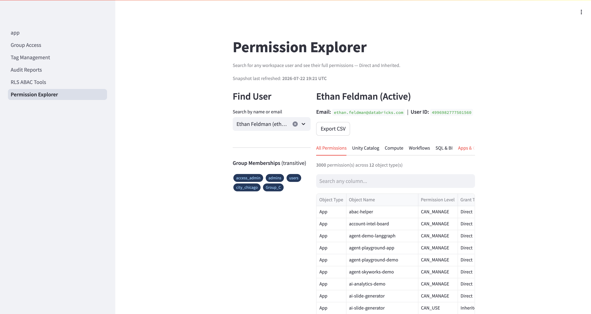
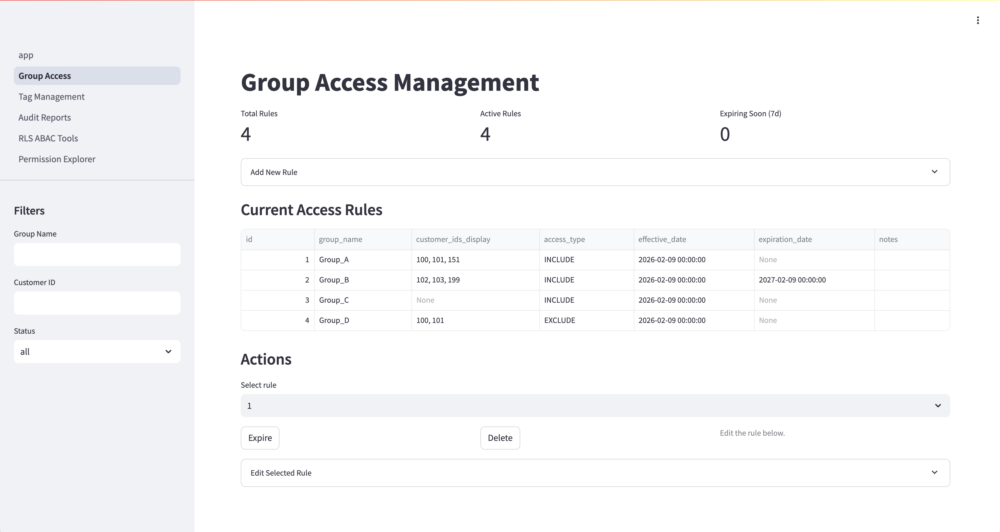
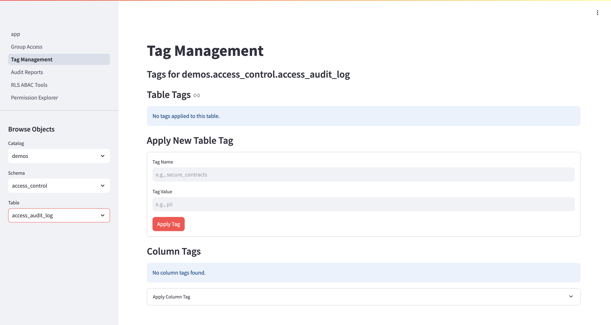
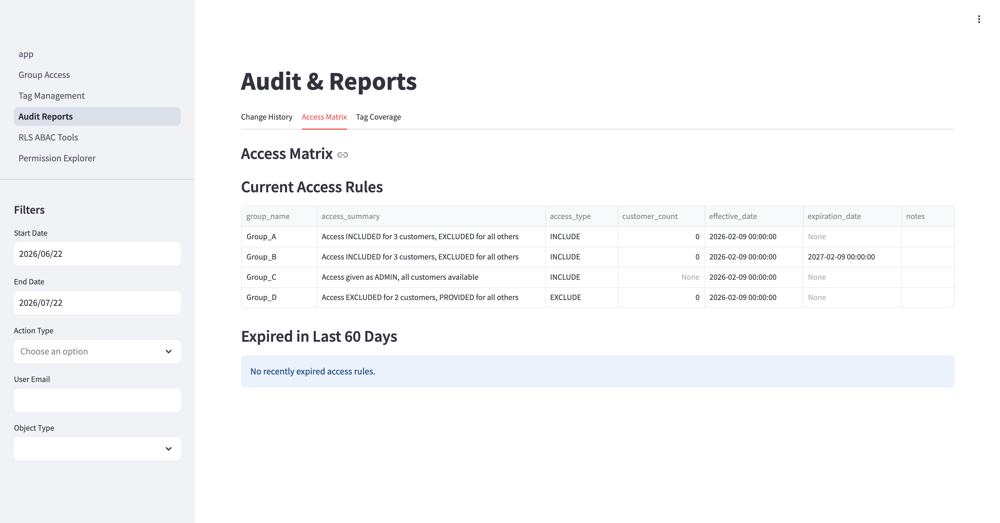
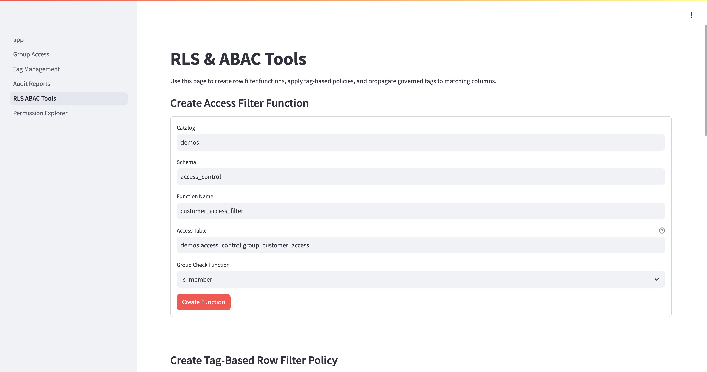

ABAC Helper App
==============

Overview
--------
This repository contains a Databricks Lakehouse App (Streamlit) for managing:
- Group-to-customer access rules used for row-level access control
- Unity Catalog governed tags on tables and columns
- Audit reporting for access and tag changes
- RLS/ABAC tooling for creating policies, functions, and propagating tags

The app is deployed with Databricks Asset Bundles and runs as a Databricks App. It
uses Databricks SQL to read and mutate Unity Catalog metadata and the access/audit
tables.

App Pages
---------
- Group Access Management
  - Create, edit, expire, and delete access rules in `group_customer_access`
  - Supports INCLUDE/EXCLUDE semantics and effective/expiration dates
- Tag Management
  - Browse catalogs/schemas/tables, view tags, and apply/remove governed tags
  - Apply column tags using a dropdown of table columns
- Audit & Reports
  - Change history from `access_audit_log`
  - Access matrix for current rules and rules expired in the last 60 days
  - Tag coverage for `secure_contracts=true` with a dropdown to select other tags
- RLS & ABAC Tools
  - Create access-filter UDFs
  - Create tag-based row filter policies
  - Propagate tag values to columns based on parent tags — a manual, container-driven
    bulk apply (stamp a column tag across every table carrying a matching parent tag).
    This is distinct from Databricks' native **Tag Propagation** (lineage-based,
    automatic; see "Related: native Tag Propagation" below).
- Permission Explorer
  - Search any workspace user and see their full effective permissions across
    Unity Catalog (catalog/schema/table/volume/function/connection/etc.), jobs,
    pipelines, SQL warehouses, dashboards, apps, Genie spaces, clusters, and
    cluster policies — both Direct and Inherited (via full transitive group nesting)
  - Backed by an on-demand snapshot in Lakebase for sub-second, complete lookups
    (see "Permission Explorer architecture" below)

Screenshots
-----------
Permission Explorer — search a user, see full effective permissions (Direct and
Inherited) across every object type, with transitive group memberships and the
snapshot freshness timestamp:



Group Access Management — INCLUDE/EXCLUDE access rules with effective/expiration dates:



Tag Management — browse catalogs/schemas/tables and apply/remove governed table
and column tags:



Audit & Reports — change history, access matrix, and tag coverage:



RLS & ABAC Tools — create row-filter functions and tag-based policies:



Related: native Tag Propagation
-------------------------------
Databricks has a native **Tag Propagation** feature (Private Preview) that
automatically applies governed tags from source tables/columns to *derived*
objects when it detects supported lineage operations (CTAS, CLONE, CREATE VIEW,
INSERT INTO … SELECT, MERGE) on serverless compute. That is lineage-based and
horizontal (source → derived object), which is different from this app's tag
propagation — a manual, container-driven bulk apply that stamps a column tag
across every table carrying a matching parent tag, and works today on classic
compute, custom tags, and existing (backfill) tables.

The two are complementary: use the native feature to keep tags flowing forward
through pipelines once it is enabled; use this app for backfilling existing
objects and for cases outside the preview's current scope (classic compute,
volumes, custom tags, synchronous application).

Note the native feature's preview limitations (serverless-only, table securable
only, governed tags only, asynchronous) and check its current GA status before
relying on it — Databricks account teams can share the Private Preview
documentation.

Permission Explorer architecture
---------------------------------
Earlier the Explorer resolved a user's permissions live: it called SCIM to list
every group, then made one Permissions/UC-grants API call per object, parallelised
only a few ways. That was slow (thousands of API calls per user click) and
incomplete — UC grants were only enumerated to schema level (table/volume grants
were hidden behind a manual drill-down), workspace objects were limited to those
the app SP could `CAN_MANAGE`, and group nesting was resolved only one level deep.

The current design pre-computes a denormalised snapshot in **Lakebase (Postgres)**
and the Explorer reads it with a single indexed query:

- **UC grants** come from `system.information_schema.*_privileges` in one bulk
  SELECT per securable level — complete (all levels, no drill-down) and fast.
- **Workspace-object ACLs** (jobs/pipelines/warehouses/dashboards/apps/genies/
  clusters/policies) come from the Permissions REST API — no system table exposes
  these, so they are collected in the background job, not at request time.
- **Group membership** is resolved once, fully transitively (any nesting depth),
  and flattened to `(principal -> all groups)` edges. This also resolves the
  opaque group UUIDs that appear as `grantee` in the privilege tables.

The snapshot is rebuilt by `app/jobs/build_permission_snapshot.py`. It is refreshed
**on demand** — run the bundle job's `build_snapshot` task, or run it locally (see
below). A Databricks job is defined in `databricks.yml` but its schedule is
**PAUSED**; unpause it only if a recurring refresh is wanted. Data is as fresh as
the last successful run (shown in the Explorer header).

This app uses its **own dedicated Lakebase instance** (`abac-helper`) — it is a
standalone project and shares no infrastructure with any other app. Lakebase tables
(schema `abac`):
- `perm_object_acls` — flat ACL rows across every object type
- `perm_identity_groups` — transitive (principal -> group) edges
- `perm_group_uuid_map` — group UUID -> display name
- `perm_snapshot_runs` — run bookkeeping / freshness badge

Run the snapshot manually (local, against ef-temp-demo):

```
cd app
DATABRICKS_CONFIG_PROFILE=ef-temp-demo \
LAKEBASE_INSTANCE=abac-helper \
LAKEBASE_HOST=ep-spring-surf-d1yujy8r.database.us-west-2.cloud.databricks.com \
LAKEBASE_USER='you@databricks.com' \
DATABRICKS_WAREHOUSE_ID=6a09f4ec67bb14b5 \
python -m jobs.build_permission_snapshot
```

Configuration
-------------
Runtime configuration is set via `app/app.yaml`:
- `DATABRICKS_SERVER_HOSTNAME`
- `DATABRICKS_HTTP_PATH` / `DATABRICKS_WAREHOUSE_ID`
- `CATALOG_NAME`
- `SCHEMA_NAME`
- `ACCESS_TABLE`
- `AUDIT_TABLE`
- `ADMIN_GROUP`

Permission Explorer (Lakebase snapshot):
- `LAKEBASE_INSTANCE` (default `account-intel-board`)
- `LAKEBASE_HOST` — Postgres endpoint host for the instance
- `LAKEBASE_DB` (default `databricks_postgres`)
- `LAKEBASE_SCHEMA` (default `abac`)
- `LAKEBASE_USER` — optional; defaults to the running identity's login

Defaults are defined in `app/config/settings.py`.

Data Model
----------
The app expects these tables in the configured catalog/schema:

`group_customer_access`:
- `group_name` STRING
- `customer_ids` ARRAY<INT> (NULL or empty means all customers)
- `access_type` STRING (INCLUDE | EXCLUDE)
- `effective_date` DATE
- `expiration_date` DATE
- `notes` STRING
- `created_by`, `created_at`, `modified_by`, `modified_at`

`access_audit_log`:
- `timestamp` TIMESTAMP
- `user` STRING
- `action_type` STRING
- `object_type` STRING
- `object_name` STRING
- `old_value`, `new_value`, `notes`

On startup the app attempts to provision these tables if missing
(`app/utils/setup_utils.py`).

Authentication and Authorization
--------------------------------
The app is intended for Databricks Apps and uses the Databricks SDK / OAuth
credentials provider to connect to the SQL Warehouse. Admin access is enforced
via:

`SELECT is_member('<ADMIN_GROUP>')`

Only members of `ADMIN_GROUP` can use the app.

Required Permissions
--------------------
The app runs as the app service principal. Ensure:

1) Service principal is a member of `access_admin` (or your configured group)
2) The admin group exists in your workspace
3) SQL Warehouse permissions:
   - `CAN_USE` on the configured SQL Warehouse
4) Unity Catalog permissions (minimum):
   - `USE CATALOG` on the target catalog
   - `USE SCHEMA` on the target schema
   - `SELECT` on:
     - `<catalog>.<schema>.group_customer_access`
     - `<catalog>.<schema>.access_audit_log`
     - `system.information_schema.tables`
     - `system.information_schema.columns`
     - `system.information_schema.table_tags`
     - `system.information_schema.column_tags`
     - `system.information_schema.schema_tags`
     - `system.information_schema.catalog_tags`
   - `INSERT`, `UPDATE`, `DELETE` on `<catalog>.<schema>.group_customer_access`
   - `INSERT` on `<catalog>.<schema>.access_audit_log`
5) Tag management:
   - `MODIFY` on any tables/columns where the app will apply/remove tags
6) RLS/ABAC tools:
   - `CREATE FUNCTION` on the schema where functions are created
   - `CREATE POLICY` on the schema where policies are created

If your workspace has stricter requirements, you may also need `OWNERSHIP`
or `MANAGE` privileges on the target schema/tables to create policies and
apply governed tags.

Permission Explorer additionally requires the app/job service principal to be a
**workspace admin** so it can:
- read all users and groups via SCIM (list users, list groups with members),
- read every object's ACL via the Permissions API (jobs, pipelines, warehouses,
  dashboards, apps, Genie spaces, clusters, cluster policies),
- `SELECT` on `system.information_schema.*_privileges`
  (`catalog_privileges`, `schema_privileges`, `table_privileges`,
  `volume_privileges`, `routine_privileges`, `connection_privileges`,
  `external_location_privileges`, `storage_credential_privileges`,
  `metastore_privileges`),
- connect to the Lakebase instance and create the `abac` schema/tables
  (`CAN_CONNECT_AND_CREATE` on the database resource; Postgres privileges on the
  `abac` schema tables are self-created on first run).

Without workspace-admin scope the snapshot is silently partial — the same
completeness gap the earlier live-API design had.

Wiring the deployed app's SP to Lakebase (one-time):
1. Attach the `database` resource to the app so the SP gets a mapped Postgres
   credential on the instance:
   `databricks apps update abac-helper --json '{"name":"abac-helper","resources":[{"name":"lakebase","database":{"instance_name":"abac-helper","database_name":"databricks_postgres","permission":"CAN_CONNECT_AND_CREATE"}}]}'`
   (also declared in `app.yaml`; the `apps update` form is the reliable path).
2. Register the SP as a Databricks-federated instance role. **Do NOT** create it with a
   raw `CREATE ROLE` — a plain Postgres role is not federated, so the SP's OAuth token
   fails with `password authentication failed`. Use the SDK so Lakebase maps the identity:
   ```python
   from databricks.sdk import WorkspaceClient
   from databricks.sdk.service.database import (
       DatabaseInstanceRole, DatabaseInstanceRoleIdentityType)
   w = WorkspaceClient()
   w.database.create_database_instance_role(
       instance_name="abac-helper",
       database_instance_role=DatabaseInstanceRole(
           name="<sp-client-id>",
           identity_type=DatabaseInstanceRoleIdentityType.SERVICE_PRINCIPAL))
   ```
3. Grant that role read on the snapshot schema (run as the instance owner):
   ```sql
   GRANT USAGE ON SCHEMA abac TO "<sp-client-id>";
   GRANT SELECT ON ALL TABLES IN SCHEMA abac TO "<sp-client-id>";
   ALTER DEFAULT PRIVILEGES IN SCHEMA abac GRANT SELECT ON TABLES TO "<sp-client-id>";
   ```

Deploying with Databricks Asset Bundles
---------------------------------------
From the repo root:

1) Validate and deploy the bundle
   - `databricks bundle validate -t dev --profile ef-temp-demo`
   - `databricks bundle deploy -t dev --profile ef-temp-demo`

2) Deploy the app from bundle source
   - `databricks apps deploy abac-helper --source-code-path "/Workspace/Users/<you>@databricks.com/.bundle/abac_helper_app/dev/files/app" --profile ef-temp-demo`

Notes
-----
- The app uses governed tags such as `secure_contracts=true` to drive ABAC
  policies and tag propagation.
- The access matrix and tag coverage views are powered by Unity Catalog
  information schema tables.
