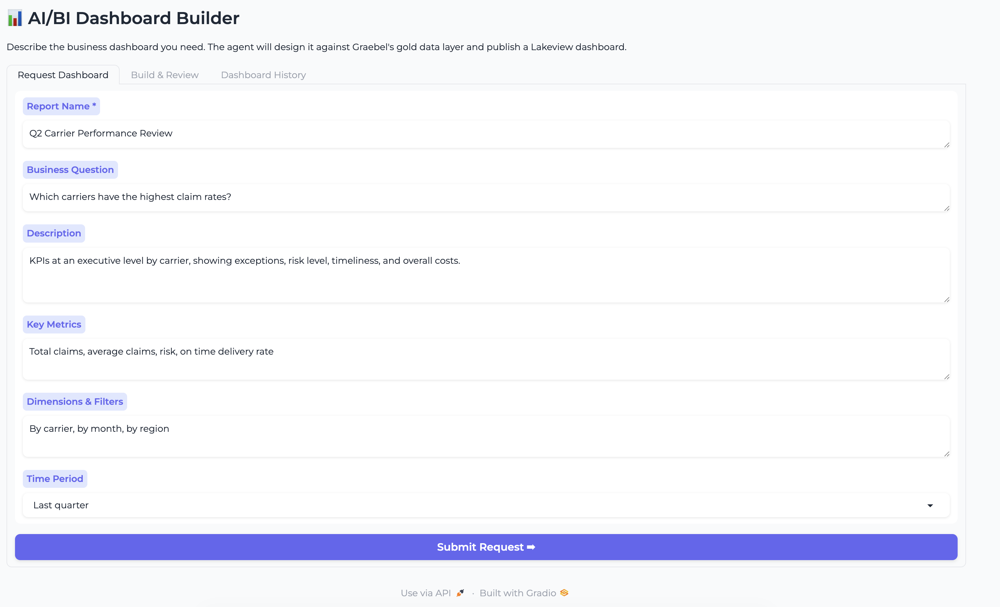
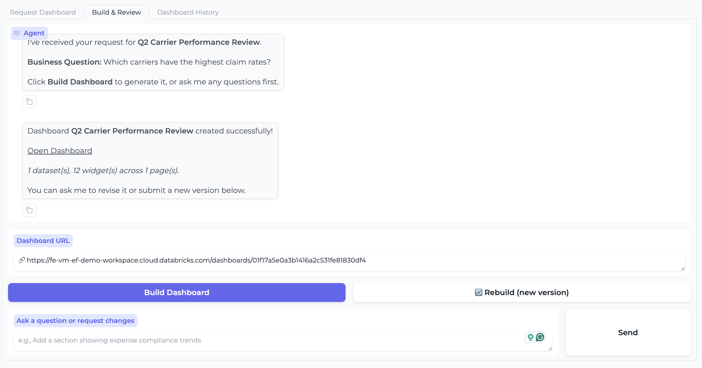
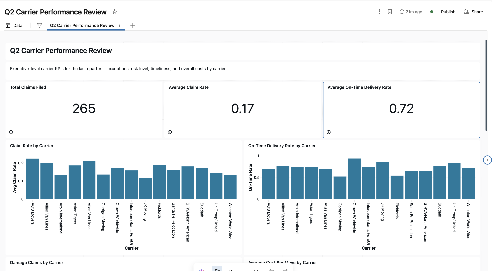

# AI/BI Dashboard Intake Builder

A Databricks App that gives business users a plain-language intake form for
requesting a dashboard, then has an LLM agent design, validate, and publish an
AI/BI (Lakeview) dashboard against your own Unity Catalog gold layer — with
version history and conversation memory persisted in Lakebase.



## What it does

- **Intake form → agent handoff.** A business user fills in a report name,
  business question, key metrics, dimensions/filters, and a time period — no
  SQL, no dashboard-building knowledge required.
- **Live schema discovery, locked to one catalog.schema.** The agent never
  sees a hardcoded table list. It looks up real tables/columns from Unity
  Catalog at request time (cached, with a safe fallback), always scoped to
  exactly the catalog/schema you configure — never derived from user input or
  model output. See "Why live discovery, not a hardcoded catalog" below.
- **A 5-phase scripted build pipeline, not a free-roaming agent.** Design SQL
  datasets → validate every query against a real warehouse → generate the
  Lakeview JSON spec → apply deterministic structural fixes → run an LLM
  review pass against the official AI/BI widget-spec docs → publish. See "Why
  a scripted pipeline" below.
- **Version control for dashboards.** Every build/rebuild is persisted as a
  new version in Lakebase, browsable (and diffable via the raw JSON) in the
  Dashboard History tab — scoped per user.
- **Conversational refinement.** Ask for changes in plain language in the
  Build & Review tab; clicking Rebuild re-runs the full pipeline with that
  conversation as context.





## How it works

```
Gradio UI (app.py)
├── Request Dashboard tab   — intake form, writes to Lakebase on submit
├── Build & Review tab      — chat, Build/Rebuild buttons, dashboard link
└── Dashboard History tab   — per-user version list + JSON preview

agent.py — build_dashboard_stream(intake, session_id, history)
├── Phase 1: design 2-6 SQL datasets (LLM), validate each against a SQL
│            warehouse (SELECT/WITH-only guard, 3 retry-with-fix attempts)
├── Phase 2: generate the full Lakeview JSON spec (LLM)
├── Phase 3: deterministic structural fixes (_fix_spec_minimal) — widget
│            versions, missing frame titles, layout repacking, field-name
│            backfill
├── Phase 4: LLM review/refine loop against the bundled AI/BI dashboard
│            skill docs (skills/databricks-aibi-dashboards), up to 3 rounds
└── Deploy:  w.lakeview.create(...) via the Databricks SDK

db.py — Lakebase (pooled psycopg connections, OAuth-refreshed per connect)
├── conversations       — one row per intake submission
├── messages            — chat history, keyed by session_id
├── dashboard_versions  — one row per build/rebuild, version_num auto-incremented
└── session_owners      — session_id → requesting user (see "Data model" below)
```

The agent talks to a Databricks Foundation Model API endpoint via an
OpenAI-compatible client (`databricks-claude-sonnet-4-6`, falling back to
`databricks-gpt-5-4` on any error) — not a tool-calling loop. It calls
`databricks_tools_core` (from
[ai-dev-kit](https://github.com/databricks-solutions/ai-dev-kit)) directly as
plain Python functions for schema discovery, and the Databricks SDK directly
for SQL validation and dashboard publishing.

## Why live discovery, not a hardcoded catalog

Early versions of this app had a hand-maintained string listing every table
and column in one specific demo schema. That doesn't travel — anyone
deploying this against their own data would be stuck hand-editing a giant
prompt string. `agent.py` now calls
`databricks_tools_core.sql.get_table_stats_and_schema(catalog, schema,
table_stat_level=NONE)` at request time and formats the result into the same
prompt shape, cached in-process for 15 minutes.

The scope itself is still fixed, on purpose: `SCOPE_CATALOG`/`SCOPE_SCHEMA` in
`agent.py` (from the `GOLD_CATALOG`/`GOLD_SCHEMA` env vars) are the only
catalog/schema discovery will ever look at — not something a user's free-text
request or the model's own output can widen. If live discovery fails (a
transient warehouse or permission issue), a static fallback string kicks in;
by default that fallback is a generic "discovery unavailable, don't guess
table names" message rather than fabricated schema info, since a fallback
tailored to one deployment's tables would be actively misleading in anyone
else's.

## Why a scripted pipeline, not a tool-calling agent

An earlier version defined a full OpenAI tool-calling schema (`execute_sql`,
`manage_dashboard`, `get_table_stats_and_schema`) that was never actually
wired into a `tools=` chat-completion call — dead scaffolding that implied a
different architecture than what ran. It's been removed. What's shipped is a
fixed, ordered pipeline: the code decides when SQL gets validated, when the
spec gets reviewed, and when it gets deployed — the model only ever produces
content for one phase at a time. For dashboard generation specifically, this
is more predictable and easier to reason about than a model deciding for
itself when to call which tool.

## Prerequisites

- A Databricks workspace with Unity Catalog, Databricks Apps, and Lakebase enabled
- A Unity Catalog catalog/schema you want dashboards built against, with at
  least one table (views work too)
- A SQL warehouse (serverless recommended) the app's identity can use
- The [Databricks CLI](https://docs.databricks.com/dev-tools/cli/index.html)
- A Foundation Model API endpoint available in your workspace serving the
  models named in `agent.py` (`PRIMARY_MODEL`/`FALLBACK_MODEL`) — or edit
  those constants to point at whatever's available to you

## Deployment

```bash
# 1. Upload the source to a workspace path
databricks workspace import-dir . /Workspace/Users/<you>/dashboard-intake-builder \
    --profile <your-profile> --overwrite

# 2. Create a Lakebase instance (name must match app.yaml's `instance:` value,
#    or edit app.yaml to match whatever you name yours)
databricks database create-database-instance dashboard-intake-builder-db \
    --capacity CU_1 --profile <your-profile>

# 3. Edit app.yaml: set GOLD_CATALOG / GOLD_SCHEMA to your own catalog/schema

# 4. Create and deploy the app
databricks apps create dashboard-intake-builder --profile <your-profile>
databricks apps deploy dashboard-intake-builder \
    --source-code-path /Workspace/Users/<you>/dashboard-intake-builder \
    --profile <your-profile>
```

Then grant the app's service principal access (see **Permissions** below) —
`databricks apps get dashboard-intake-builder` prints its `service_principal_id`.

Redeploy after any code change with just the last `databricks apps deploy`
command above (re-run step 1 first if you edited files locally).

## Configuration reference

| Env var | Set where | Default | What it controls |
|---|---|---|---|
| `GOLD_CATALOG` | `app.yaml` | `your_catalog` | Unity Catalog catalog the agent is scoped to |
| `GOLD_SCHEMA` | `app.yaml` | `your_schema` | Unity Catalog schema the agent is scoped to |
| `LAKEBASE_INSTANCE` | `app.yaml` | `dashboard-intake-builder-db` | Lakebase instance name used for OAuth credential generation — must match `resources[].database.instance` in the same file |
| `PGHOST`/`PGDATABASE`/`PGUSER`/`PGPORT` | auto-injected | — | Set by the platform once the Lakebase resource above is attached; don't set these yourself |

`PRIMARY_MODEL`/`FALLBACK_MODEL` (Foundation Model API serving-endpoint names)
and `max_rounds` for the Phase 4 review loop are constants in `agent.py`
rather than env vars — edit directly if you need different models or a
longer/shorter review loop.

## Permissions

- **Unity Catalog**: grant the app's service principal `USE CATALOG`/`USE
  SCHEMA`/`SELECT` on `GOLD_CATALOG.GOLD_SCHEMA`.
- **SQL warehouse**: grant the service principal `CAN_USE` on a warehouse
  (the app auto-selects any `RUNNING`/`STOPPED` warehouse it can see via
  `w.warehouses.list()` — no specific warehouse ID is configured).
- **Lakebase**: attaching the `lakebase` resource in `app.yaml` at deploy time
  handles this automatically (`CAN_CONNECT_AND_CREATE`).
- **Per-user Dashboard History** (optional but recommended): in the app's
  settings in the workspace UI, enable **User Authorization** and add the
  `iam.current-user:read` scope. Without it, `db.py` falls back to bucketing
  all history under `"unknown"` — every user sees the same shared history
  instead of just their own.

## Data model

`conversations`, `messages`, and `dashboard_versions` hold the actual intake,
chat, and version data. `session_owners` (`session_id → created_by`) is a
separate table rather than a `created_by` column on those three — adding a
column to a pre-existing table requires owning that table, which isn't
guaranteed (in practice, the tables here were created once and the owning
role can differ across environments/redeploys). A table the app creates
itself has no such dependency, so per-user scoping is a `JOIN` against
`session_owners` rather than an `ALTER TABLE`.

## Known limitations

- **SELECT-only guard, not a full SQL parser.** `agent._reject_if_not_read_only`
  rejects anything that isn't a plain `SELECT`/`WITH` query, plus a
  word-boundary check for write keywords (`INSERT`, `DROP`, `MERGE`, etc.)
  anywhere in the query. It's a pragmatic defense against a bad generation or
  a prompt-injection attempt in the intake text, not a substitute for running
  the app's service principal with genuinely read-only grants.
- **The Phase 4 reviewer is an LLM, and LLMs don't always follow strict output
  formatting.** The system prompt is explicit that the response must be
  either the literal word `APPROVED` or a raw JSON object, and an
  unparseable response now retries (with a stronger reminder) rather than
  silently giving up — but a model that repeatedly refuses to comply will
  still exhaust `max_rounds` and fall through with the pre-review spec.
- **Time Period is advisory, not enforced.** The dropdown value is passed to
  the model as context; nothing forces the generated SQL to actually filter
  by it.

## Third-party skill docs

`skills/databricks-aibi-dashboards/` is vendored from
[databricks-solutions/ai-dev-kit](https://github.com/databricks-solutions/ai-dev-kit)
(`databricks-skills/databricks-aibi-dashboards`), bundled here rather than
loaded from a separate workspace path so this app has no runtime dependency
on anything outside its own deployed source. `LICENSE.md`/`NOTICE.md` inside
that folder are the upstream license/attribution, carried over unmodified per
its terms. If you update these docs, pull a fresh copy from the upstream repo
rather than hand-editing the vendored copy.

## Project structure

```
dashboard-intake-builder/
├── app.py                 # Gradio UI, event handlers, per-user identity
├── agent.py                # Build pipeline, live schema discovery, review loop
├── db.py                   # Lakebase pooled connections + schema
├── app.yaml                # Databricks App config (resources, env vars)
├── requirements.txt
├── skills/
│   └── databricks-aibi-dashboards/   # vendored ai-dev-kit skill docs (see above)
└── images/                 # screenshots used in this README
```
