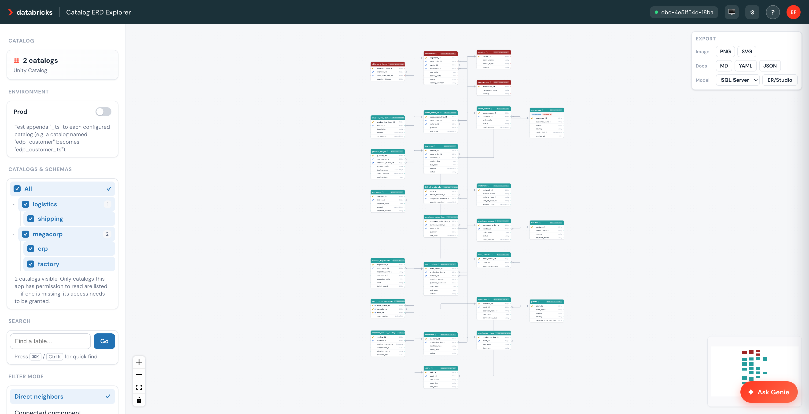
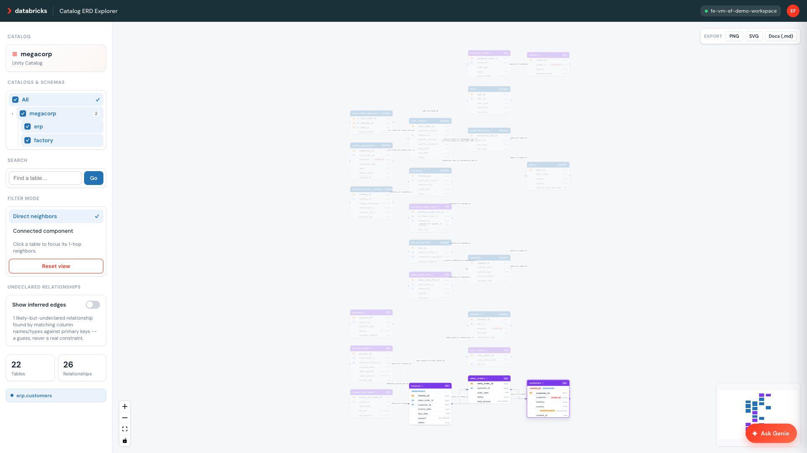
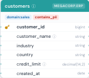
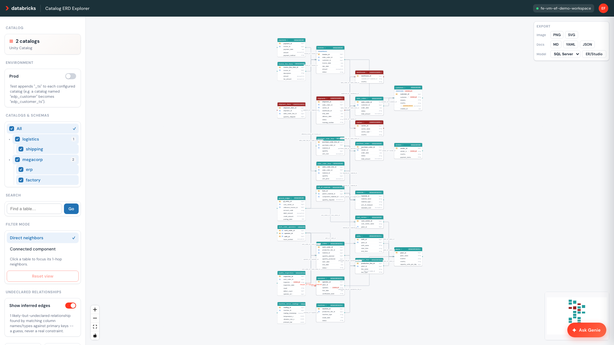
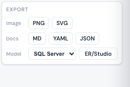
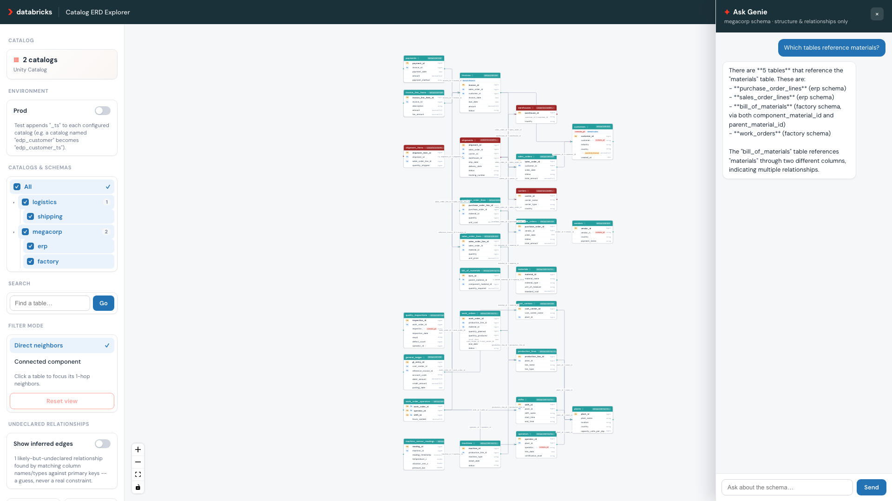

# Interactive Unity Catalog ERD Viewer

A Databricks App that turns Unity Catalog's `information_schema` metadata into an
interactive, explorable entity-relationship diagram — with a built-in Genie chat for
asking schema questions in plain English.



## What it does

- **Renders a live ERD** for one or more Unity Catalog catalogs: every table as a node
  (with its columns, and PK/FK columns badged), every declared foreign key as a labeled,
  directional edge from the referencing table to the table it points to.
- **Catalog/schema tree picker**: an "All" toggle plus one row per catalog (tri-state
  checkbox: unchecked / indeterminate / checked) that expands to show its individual
  schemas, each independently selectable — built for a future with many catalogs each
  containing many schemas, not just the shipped single-catalog demo.
- **Click-to-filter**: click any table and the canvas highlights just its connected
  neighborhood — toggle between "direct neighbors" and "full connected component," with
  a one-click reset back to the whole graph.
- **Ask Genie**: a slide-in chat panel backed by a Genie Space that can answer questions
  like *"which tables reference `orders`?"*, *"what's the primary key of `invoices`?"*,
  or *"which tables have no foreign keys?"* — scoped so it can **only** ever see the
  catalogs you explicitly approved, never anything else in the workspace (see "Unscoped
  mode" below for the one deliberate exception).
- **No source data required**: everything is read from `information_schema` /
  `system.information_schema`, so this works against any Unity Catalog catalog with
  declared PK/FK constraints — you don't need to grant it access to actual row data.
- **UC comments and tags surfaced in the diagram**: table/column `COMMENT`s render as a
  hover tooltip (an "ⓘ" icon marks anything with one), and Unity Catalog tags (e.g. a PII
  classification) render as small colored badges on the table header and/or individual
  column rows — turning the diagram into a real catalog browser, not just a shape.
- **Inferred (undeclared) relationships**: a low-confidence heuristic flags columns that
  look like an undeclared foreign key (same name + type as another table's primary key,
  no formal constraint declared) and renders them as dashed, distinctly colored edges,
  clearly labeled "inferred" — off by default, one click to show, never presented as
  equivalent to a real constraint.
- **Keys-only column view**: a sidebar toggle that collapses every table to just its
  primary- and foreign-key columns, so wide tables (dozens of columns) stay readable. A
  table with no declared PK/FK renders as a header-only card — expected, and called out
  in the toggle's hint along with a count of the affected tables. Purely client-side (the
  graph already carries per-column PK/FK flags), so toggling is instant and never
  re-queries. When "inferred relationships" are also shown, the column backing each
  visible inferred edge is revealed too, so a dashed edge is never left pointing at a
  table with no visible column.
- **Scales to large catalogs**: `/api/graph` results are cached in-memory, and catalogs
  above a configurable table-count threshold default to one node per schema instead of
  one per table — click a schema node to expand it to full table-level detail (the same
  underlying mechanism as the catalog/schema tree picker, not a separate interaction).
- **Color-coded by catalog**: every table's header is colored by which catalog it's in
  (not schema — a real deployment scopes many schemas under one catalog, and "which
  catalog is this in" is the useful grouping for a multi-catalog customer). Colors are
  computed fresh for whichever catalogs are actually in the current view, spaced evenly
  around the color wheel (360° / catalog count) so any two catalogs on screen are always
  maximally distinguishable — not a fixed name→color lookup, which can only ever be
  coincidentally well-separated for whichever specific catalogs a given customer has.
- **Export**, scoped to whatever's currently selected (a catalog/schema picker
  narrowing, or a click-to-filter table selection) — computed entirely client-side from
  the already-loaded graph, no extra server round-trip:
  - **PNG / SVG** — the canvas as an image, cropped to just the in-scope nodes.
  - **Markdown / YAML / JSON** — a structured schema doc (tables, columns, PK/FK flags,
    comments, tags, declared + inferred relationships).
  - **ER/Studio** (SQL Server or Oracle dialect) — a `.zip` with `physical_model.sql`
    (DDL with `PRIMARY KEY`/`FOREIGN KEY` constraints, for ER/Studio's
    reverse-engineer-from-DDL import), `metadata.csv` (one row per column, including UC
    comments/tags), and `unsupported_types.md` (any column whose Unity Catalog type has
    no direct relational equivalent, e.g. `ARRAY`/`MAP`/`STRUCT`/`VARIANT`, and what it
    was mapped to instead). Only **declared** foreign keys become DDL constraints —
    inferred/undeclared relationships are listed in `metadata.csv` only, never as a
    constraint, since they're a heuristic guess, not a real one.

  Example output, generated from the packaged demo data, checked in at
  [`docs/example-exports/`](docs/example-exports/):
  [Markdown](docs/example-exports/erd-schema-docs.md) ·
  [YAML](docs/example-exports/erd-schema-docs.yaml) ·
  [JSON](docs/example-exports/erd-schema-docs.json) ·
  [ER/Studio `.zip`](docs/example-exports/erd-erstudio-export.zip) (extracted:
  [`physical_model.sql`](docs/example-exports/erstudio/physical_model.sql),
  [`metadata.csv`](docs/example-exports/erstudio/metadata.csv),
  [`unsupported_types.md`](docs/example-exports/erstudio/unsupported_types.md))











## Why the Genie scoping matters

Most "point an LLM at your metadata" tools rely on prompt instructions to keep the
assistant in its lane ("only answer about catalog X"). Instructions are soft — a
determined question can talk around them. This app takes a different approach:

Genie is built on **dedicated Unity Catalog views** whose `WHERE table_catalog IN (...)`
clause is baked into the view DDL itself. Genie's SQL execution can only ever resolve
those views, so there is no query it could construct that reaches a catalog outside your
approved list — regardless of what the underlying service principal can otherwise browse.
The boundary lives in the data model, not in the prompt.

## Architecture

```
Databricks App (FastAPI backend + React/Vite frontend, Databricks-brand light theme)
├── Backend
│   ├── GET  /api/graph        → nodes (tables+columns) + edges (FK→PK), optionally
│   │                             narrowed via ?pairs=catalog.schema,..., queried live
│   │                             from system.information_schema
│   ├── GET  /api/schema-tree  → {catalog: [schema, ...]} enumeration for the picker
│   ├── GET  /api/config       → which catalogs this deployment is scoped to
│   └── POST /api/genie/ask    → starts/continues a Genie conversation, polls internally,
│                                 returns the final answer in one round-trip
├── Frontend (React Flow + dagre auto-layout)
│   ├── ERD canvas, PK/FK badges, labeled FK→PK edges
│   ├── Click-to-filter (client-side BFS: neighbors / connected component + reset)
│   ├── Catalog/schema tree picker + table search
│   └── Genie side panel
└── Setup (idempotent, chained as a single Databricks Job — see Deployment below)
    ├── create_scoped_views.py  → creates the hard-scoped metadata views that are
    │                              Genie's actual data source and access boundary
    └── create_genie_space.py  → creates/updates the Genie Space over 3 of those views
        (table_summary, column_inventory, fk_edges), and grants the app's own service
        principal access to the space
```

The scoped metadata views (in `{ERD_METADATA_LOCATION}`, e.g. `your_catalog.erd_meta`):

| View | Purpose |
|---|---|
| `table_summary` | One row per table — column count, PK column count, incoming/outgoing FK counts. Answers "what tables exist" and "which tables have no foreign keys." |
| `column_inventory` | One row per column, with `is_primary_key`/`is_foreign_key` flags. Answers "what columns does X have." |
| `fk_edges` | One row per foreign-key relationship (`fk_table.fk_column → pk_table.pk_column`). Answers "what references X" and "what does X join to." |

These 3 are the only views curated into the Genie Space — deliberately narrow, per
Databricks guidance that Genie Spaces perform best small and focused. They're built on
top of 5 internal, 1:1-filtered mirrors of `system.information_schema.*` (also created by
`create_scoped_views.py`) that are never exposed to Genie directly.

## Demo data

The default config points at a synthetic `megacorp` catalog, but **deploying this project
does not create it for you** — nothing runs automatically against your workspace beyond
the app and its Genie setup job. Creating the demo data is an explicit, opt-in step on
both routes (Route 1: run `setup/create_megacorp_demo.py` yourself; Route 2: the
`create_demo_data` notebook widget, default `no`) — most real deployments will point
`erd_catalogs` at their own existing catalog(s) instead and skip this entirely.

If you do opt in, you get a fictional manufacturer with a **factory** schema (plants,
production lines, machines, materials, work orders, quality inspections, sensor readings,
shifts, operators) and a SAP-style **erp** schema (customers, vendors, sales/purchase
orders, invoices, payments, cost centers, general ledger). 22 tables, 26 foreign keys,
including cross-schema references and one deliberately *undeclared* relationship
(`quality_inspections.operator_id`, for demoing the inferred-relationship heuristic) —
enough to be a genuinely interesting graph without needing any real customer data. DDL is
in `setup/megacorp_schema.sql`; no rows are populated, only structure.

**Target catalog is configurable, not hardcoded to "megacorp"** — pass `--catalog
<name>` (Route 1) or set the `demo_catalog` widget (Route 2, default blank -- reuses
`erd_catalogs`'s first entry so you don't have to type the same catalog name twice, or
falls back to `megacorp` if that's also blank) to put the demo data somewhere else.
`setup/create_megacorp_demo.py` handles three cases: no catalog given → use/create
`megacorp`; a given catalog that doesn't exist yet → create it, then the schemas/tables;
a given catalog that already exists → skip `CREATE CATALOG` entirely and just add the
schemas/tables to it. That last case matters because `CREATE CATALOG` needs
metastore-level privilege a deployer pointed at an existing catalog may not have (and
shouldn't need) — creating schemas/tables inside a catalog they already have access to
is a much lower bar.

A second, separate opt-in (`setup/megacorp_demo_metadata.sql`, via `--with-metadata` /
`--metadata-only` on Route 1, or the `add_demo_metadata` widget on Route 2, default `no`)
layers a handful of illustrative `COMMENT`s and Unity Catalog tags onto a few megacorp
columns/tables, purely to demo the comment/tag surfacing feature. It's independent of
catalog creation on purpose — even someone deploying the demo data may want the bare
structure without fabricated metadata opinions layered on top, and it can be re-run later
against a catalog that already has the demo structure from a previous run.

## Prerequisites

- A Databricks workspace with Unity Catalog and Databricks Apps enabled
- The [Databricks CLI](https://docs.databricks.com/dev-tools/cli/index.html) (`databricks bundle` support)
- A SQL warehouse (serverless recommended)
- `uv` (Python) and `npm` (Node) for local development / building the frontend
- Enough Unity Catalog privilege to `GRANT` on your target catalog(s) — either you're an
  admin, or you can ask one to run the grant step below

## Two ways to deploy

Both routes run the exact same underlying setup logic (`setup/create_scoped_views.py` +
`setup/create_genie_space.py`), so behavior never diverges between them — pick whichever
fits how your team works.

### Route 1: CLI + Databricks Asset Bundle

For anyone with local CLI access.

```bash
git clone <this-repo> && cd erd-explorer
cd frontend && npm install && npm run build && cd ..   # build the React SPA first
databricks auth login --host <your-workspace-url> --profile <your-profile>
databricks bundle deploy -t dev -p <your-profile>
```

At this point the app and its setup job exist in the workspace but the demo catalog and
Genie Space don't yet. Finish the bootstrap:

```bash
# 1. Create the synthetic megacorp demo data (skip this if pointing at your own catalog(s)
#    instead). --catalog defaults to "megacorp"; pass a different name to put it elsewhere --
#    created if it doesn't exist yet, used as-is if it already does. Add --with-metadata to
#    also do step 1b below in the same command.
uv run --with databricks-sdk python setup/create_megacorp_demo.py --warehouse-id <your-warehouse-id> --profile <your-profile> [--catalog <name>]

# 1b. (optional, independent of step 1 -- re-runnable on its own against a catalog that
#     already has the demo structure) Add illustrative comments/tags to the demo data, to
#     demo the comment/tag surfacing feature. Skip for bare structure only.
uv run --with databricks-sdk python setup/create_megacorp_demo.py --warehouse-id <your-warehouse-id> --profile <your-profile> [--catalog <name>] --metadata-only

# 1c. (optional -- skip if you only want one catalog) A second catalog cross-linked to
#     megacorp by a real foreign key, so multi-catalog rendering has something real to
#     show. --megacorp-catalog must match the catalog name used in step 1.
uv run --with databricks-sdk python setup/create_logistics_demo.py --warehouse-id <your-warehouse-id> --profile <your-profile> [--catalog <name>] [--megacorp-catalog <name>]

# 2. Grant the app's service principal access to it (see "Permissions" below for details --
#    this looks up the service principal for you, no copy/paste needed). List every
#    catalog from steps 1/1c.
uv run --with databricks-sdk python setup/grant_catalog_access.py \
    --warehouse-id <your-warehouse-id> --profile <your-profile> \
    --app-name erd-explorer-dev --catalogs megacorp,logistics --metadata-location megacorp.erd_meta

# 3. Create the scoped metadata views + Genie Space (idempotent, safe to re-run)
databricks bundle run setup_genie_space -t dev -p <your-profile>

# 4. Start the app
databricks bundle run erd_explorer_app -t dev -p <your-profile>
```

Open the URL printed by step 4.

**Setting up the Prod/Test toggle's test catalogs** (optional): repeat steps 1/1c/2 once
more, using the test-suffixed catalog names throughout (e.g. `--catalog megacorp_ts`,
then `--catalog logistics_ts --megacorp-catalog megacorp_ts`, then
`--catalogs megacorp_ts,logistics_ts` for the grant step) -- these are real, separate
Unity Catalog catalogs, not an alias, so they need their own data and their own grants.
See "Prod/Test catalog toggle" below.

**Deploying against your own catalog(s)** instead of (or in addition to) the demo data:

```bash
databricks bundle deploy -t dev -p <your-profile> \
    --var="erd_catalogs=sales,inventory" \
    --var="erd_metadata_location=sales.erd_meta" \
    --var="warehouse_id=<your-warehouse-id>"
```

Then run the same steps 2–4 above. The catalog list and metadata location are one
variable each, consumed by both the app and the Genie setup job — they can't drift apart.

### Route 2: Git folder + notebook (no CLI required)

For teams without local CLI/terminal access, or who'd rather configure and deploy
entirely from inside the workspace UI.

1. In the Databricks workspace UI: **Workspace ▸ Git Folders ▸ Add repo**, paste the
   `demo-assets` repo's URL.
2. Open `uc_erd_explorer/notebooks/install.py` from inside that folder.
3. Click **Run all** once — this renders the configuration widgets at the top of the
   notebook (they take the place of the CLI route's `--var` bundle variables):

   | Widget | Required | What it controls |
   |---|---|---|
   | `repo_root` | yes | Workspace path to the **`uc_erd_explorer` folder** -- one level in from the `demo-assets` git checkout, e.g. `/Workspace/Users/you@company.com/demo-assets/uc_erd_explorer` (right-click the `uc_erd_explorer` folder → "Copy path" if unsure). Do **not** point this at the `demo-assets` checkout root -- `demo-assets` is a monorepo of several demos and this app is one subfolder in it. |
   | `warehouse_id` | yes | SQL warehouse id |
   | `app_name` | no (default `erd-explorer`) | Databricks App name |
   | `erd_catalogs` | no (default `megacorp`) | Comma-separated catalog allow-list. Clear it entirely for unscoped mode (every catalog visible to this deployment — see "Unscoped mode" below) |
   | `erd_metadata_location` | no (default `<first catalog>.erd_meta`) | Where the scoped Genie views live. **Required** if you clear `erd_catalogs` |
   | `create_demo_data` | no (default `no`) | Set to `yes` to create the synthetic megacorp schemas/tables in `demo_catalog`. Works whether `demo_catalog` already exists (e.g. you don't have CREATE CATALOG permission -- only schemas/tables get added to it) or not (it gets created too) |
   | `demo_catalog` | no (default blank) | Catalog to create the demo data in, only used if `create_demo_data=yes`. Blank reuses the first `erd_catalogs` entry, so the common case (demo data + app pointed at the same catalog) only needs `erd_catalogs` filled in; falls back to `megacorp` if `erd_catalogs` is also blank |
   | `add_demo_metadata` | no (default `no`) | Independent of `create_demo_data` -- set to `yes` to also layer illustrative comments/tags onto the demo data, for demoing the comment/tag surfacing feature |
   | `auth_mode` | no (default `service_principal`) | Query identity: `service_principal` (the app's own SP, bounded by `erd_catalogs`) or `on_behalf_of_user` (queries as the logged-in user — see "On-behalf-of-user authorization"). OBO also grants the app the `sql` user scope and skips the SP's data-catalog grants (granting only the Genie metadata location) |

4. Fill in the widgets, then **Run all** again. The notebook will, in order: optionally
   create the demo data, create the scoped Genie metadata views, stage an isolated
   deploy folder (so widget-driven config never touches the tracked `app.yaml`), create
   the Databricks App and deploy it, create/update the Genie Space and grant the app
   access to it, redeploy with the real Genie Space id and start the app, then grant the
   app's service principal Unity Catalog access to `erd_catalogs` (see **Permissions**
   below — this requires *you* to already have grant-issuing rights on those catalogs;
   if you don't, it prints the exact SQL for a catalog admin to run instead). It prints
   the app URL at the end.

The notebook is idempotent (safe to "Run all" repeatedly, e.g. after changing widget
values) and calls the identical `setup/create_scoped_views.py` /
`setup/create_genie_space.py` functions the CLI route's job does — it's a different
front door onto the same automation, not a separate implementation to maintain.

## Adding a new catalog after you've already deployed

Both routes are idempotent, so widening scope later is the same deploy flow you used
initially, not a separate procedure. There is intentionally no in-app "add a catalog"
button — the app's own service principal only holds read access to its configured
catalogs, and doing this from inside the running app would mean giving it grant-issuing
UC permissions and the ability to redeploy itself, a much bigger permission footprint
than an ERD viewer needs. Adding a catalog stays a deploy-time (CLI or notebook) action:

**Via the CLI/DAB route:**
```bash
# 1. Redeploy with the catalog added to erd_catalogs -- the ERD graph picks this up
#    immediately, since /api/graph queries information_schema live.
databricks bundle deploy -t dev -p <your-profile> \
    --var="erd_catalogs=sales,inventory,newcatalog" \
    --var="erd_metadata_location=sales.erd_meta" \
    --var="warehouse_id=<your-warehouse-id>"

# 2. Grant the app's service principal access to the FULL list (existing + new --
#    idempotent, only issues GRANTs, so re-listing already-granted catalogs is harmless).
uv run --with databricks-sdk python setup/grant_catalog_access.py \
    --warehouse-id <your-warehouse-id> --profile <your-profile> \
    --app-name erd-explorer-dev --catalogs sales,inventory,newcatalog --metadata-location sales.erd_meta

# 3. Resync the Genie Space -- its view/table list is saved config, not live like the
#    graph, so it won't see the new catalog until this runs.
databricks bundle run setup_genie_space -t dev -p <your-profile>
```

**Via the notebook route:** re-run `notebooks/install.py` — update the `erd_catalogs`
widget to include the new catalog(s) and click **Run all** again. It performs the
equivalent of all three steps above (redeploy, grant, Genie resync) in one pass.

Either way, remember the asymmetry from "One asymmetry worth knowing" above: the graph
updates the moment you redeploy, but the Genie Space needs its explicit resync step (or
the notebook re-run) to catch up.

## Configuration reference

| Bundle variable | Env var (equivalent) | Default | What it controls |
|---|---|---|---|
| `warehouse_id` | `DATABRICKS_WAREHOUSE_ID` | **required, no default** | SQL warehouse used for all `information_schema` queries |
| `erd_catalogs` | `ERD_CATALOGS` (comma-separated) | `megacorp,logistics` (packaged demo default) | The catalog allow-list — scopes **both** the ERD graph and the Genie Space. Set to an empty string for unscoped mode, see below |
| `erd_metadata_location` | `ERD_METADATA_LOCATION` (`"catalog.schema"`) | `megacorp.erd_meta` | Where the scoped Genie metadata views live. **Required** if `erd_catalogs` is empty (no catalog to default from) |
| `genie_space_id` | `GENIE_SPACE_ID` | (set after first setup run) | Which Genie Space the chat panel talks to |
| `erd_cache_ttl_seconds` | `ERD_CACHE_TTL_SECONDS` | `300` | How long `/api/graph` results are cached in-memory before re-querying `information_schema` |
| `erd_schema_collapse_threshold` | `ERD_SCHEMA_COLLAPSE_THRESHOLD` | `80` | Table count above which the ERD defaults to one node per schema (click to expand); `0` always renders full detail |
| `erd_test_catalog_suffix` | `ERD_TEST_CATALOG_SUFFIX` | `_ts` | Suffix appended to each `erd_catalogs` entry when the frontend's Prod/Test toggle is set to Test (e.g. `edp_customer` → `edp_customer_ts`) |
| `auth_mode` | `ERD_AUTH_MODE` | `service_principal` | Which identity the ERD queries run as. `service_principal` (default) queries as the app's own SP, bounded by `erd_catalogs`. `on_behalf_of_user` queries as the **logged-in user**, filtered by their own UC privileges — see "On-behalf-of-user authorization" below |
| `user_api_scopes` | *(app config, not an env var)* | `[]` | User authorization scopes the app requests for OBO; set to `["sql"]` for `on_behalf_of_user`. A **complex** (list) value the CLI can't set via `--var`, so it's declared at the bundle **target** level — see below |

### Prod/Test catalog toggle

If a customer has a parallel test catalog per prod catalog (e.g. `edp_customer` and
`edp_customer_ts`), the sidebar's Environment switch lets a user flip between them without
redeploying: Prod queries `erd_catalogs` as configured; Test queries the same list with
`erd_test_catalog_suffix` appended to each entry. These are two distinct real Unity
Catalog catalogs, not an alias — the toggle re-fetches the catalog/schema tree and graph
against whichever one is selected, and resets the current catalog/schema selection (a
selection made under one environment names catalogs that don't exist under the other).
Only available in scoped mode (`erd_catalogs` set) — an unscoped deployment has no defined
catalog list to derive a test name from, so the toggle is disabled there. The Genie Space
is **not** affected by this toggle — it stays scoped to whatever `erd_catalogs`/
`erd_metadata_location` were configured at setup time, since it's a static, pre-built
resource rather than a live per-request filter.

The test-suffixed catalogs (e.g. `megacorp_ts`) are real, separate Unity Catalog
catalogs — `grant_catalog_access.py` (or a catalog admin) needs to grant the app's
service principal access to them too, same as the prod ones, or Test mode will just show
an empty graph. See "Setting up the Prod/Test toggle's test catalogs" above.

**One asymmetry worth knowing**: the ERD graph is queried live, so changing
`erd_catalogs` and redeploying takes effect immediately. The Genie Space's views and
table list are saved configuration — after changing `erd_catalogs` or
`erd_metadata_location`, re-run `databricks bundle run setup_genie_space` to resync it.
That job is idempotent and finds/updates its own space automatically (via a stable
marker in the space description, not its title, so a changed catalog list won't create a
duplicate space).

### Unscoped mode

Leaving `erd_catalogs`/`ERD_CATALOGS` **empty** is a deliberate, explicit choice — not a
silent fallback — that scopes both the graph and the Genie Space to *every catalog this
deployment's own credentials can browse*, instead of an explicit allow-list. Unity
Catalog's own privilege filtering still applies: "unscoped" means "whatever this
deployment's grants allow," not literally every catalog that exists in the metastore.

```bash
databricks bundle deploy -t dev -p <your-profile> \
    --var="erd_catalogs=" \
    --var="erd_metadata_location=<some_catalog>.erd_meta" \
    --var="warehouse_id=<your-warehouse-id>"
```

Per a deliberate design decision: Genie mirrors this choice exactly — an unscoped graph
means an unscoped Genie Space too, not a Genie Space quietly kept narrow while the graph
widens. If you want Genie to stay narrowly scoped, use an explicit `erd_catalogs` list
instead of unscoped mode.

`erd_metadata_location` becomes **required** in unscoped mode (there's no "first catalog"
in the list to default the metadata views into) and can point at any catalog you like,
including one not otherwise shown in the graph.

### On-behalf-of-user (OBO) authorization

By default the ERD queries `information_schema` as the app's **own service principal**,
bounded by `erd_catalogs` — every user sees the same graph. Set `auth_mode` /
`ERD_AUTH_MODE` to `on_behalf_of_user` to instead run every metadata query as the
**logged-in user**, via the token Databricks Apps forward in the `x-forwarded-access-token`
header. The graph is then filtered by that user's own Unity Catalog privileges,
intersected with `erd_catalogs` (which still applies as the upper-bound allow-list).
Different users can see different diagrams, and the app's service principal no longer needs
broad data grants. The default (`service_principal`) is unchanged, so nothing switches to
OBO unless you deploy with the flag.

OBO needs three things:

1. **`ERD_AUTH_MODE=on_behalf_of_user`** on the app.
2. **The `sql` user authorization scope** granted to the app, so the forwarded user token
   can call the SQL Statement Execution API. This is declared as `user_api_scopes: ["sql"]`
   and **must** be part of the deploy config — not set out-of-band via `apps update`,
   because `bundle deploy` regenerates the app resource and would silently reset the scope
   on the next deploy.
3. **Each end user needs `CAN_USE` on the SQL warehouse** plus their own UC privileges on
   the catalogs — the query runs as them, not the SP.

Because `user_api_scopes` is a complex (list) value the CLI can't set via `--var`, OBO on
the **CLI/DAB route** is expressed as a dedicated bundle **target** rather than a bare
flag:

```yaml
targets:
  obo:                       # deploy with: databricks bundle deploy -t obo -p <profile> ...
    variables:
      auth_mode: "on_behalf_of_user"
      user_api_scopes: ["sql"]
```

```bash
databricks bundle deploy -t obo -p <profile> \
    --var="warehouse_id=<your-warehouse-id>" --var="erd_catalogs=<your-catalogs>"
databricks bundle run erd_explorer_app -t obo -p <profile> \
    --var="warehouse_id=<your-warehouse-id>" --var="erd_catalogs=<your-catalogs>"
```

On the **notebook route**, set the `auth_mode` widget to `on_behalf_of_user`. The notebook
sets `ERD_AUTH_MODE`, applies the `sql` scope via the Apps API (which persists there, since
the notebook manages the app directly rather than through a regenerated bundle spec), and
grants the SP **only** the Genie metadata location — no data-catalog grants, since the ERD
runs as the user.

**Genie stays on the service principal** in both modes — the chat proxy isn't part of OBO,
and its scoped views still need the SP granted on `erd_metadata_location` (the deploy
handles this).

## Permissions

Two things need granting. Both are automated now — you don't need to hand-craft or
copy/paste GRANT statements — but both still depend on *you* (whoever runs the script)
already having grant-issuing rights on the target catalog(s); if you don't, the
automation fails per-statement with a clear permission error and prints the exact SQL
for a catalog admin to run instead of aborting the whole setup.

**1. Unity Catalog data access** (lets `/api/graph` and the scoped views actually return
rows — without this, queries succeed but silently return zero rows, not an error).
`setup/grant_catalog_access.py` looks up the app's service principal via the Apps API
itself (no copy/paste) and grants catalog-level `USE CATALOG`/`USE SCHEMA`/`SELECT` —
cascading to every schema/table inside, matching `erd_catalogs` being catalog-level
scoping — on each catalog in `erd_catalogs`, plus a schema-specific grant on wherever
`erd_metadata_location` actually points (which may be a different catalog entirely):

```bash
uv run --with databricks-sdk python setup/grant_catalog_access.py \
    --warehouse-id <your-warehouse-id> --profile <your-profile> \
    --app-name erd-explorer-dev --catalogs megacorp --metadata-location megacorp.erd_meta
```

Route 2 (notebook) runs this automatically as its own step, reusing the same function.
Skipped entirely in unscoped mode (`erd_catalogs` blank) — there's no fixed catalog list
to grant on; the app relies on whatever grants its service principal already has.

**2. Genie Space access** — a Genie Space is a workspace object with its own separate
ACL from Unity Catalog grants. This one is also automated: `setup/create_genie_space.py`
takes `--grant-to-app <app-name>` (already wired into the DAB job) and grants the app's
service principal `CAN_RUN` on the space automatically every time the setup job runs.

**On-behalf-of-user mode** (`auth_mode=on_behalf_of_user`): the ERD queries run as the
logged-in user, so the app's service principal does **not** need the catalog data grants
in (1) — each user's own UC privileges govern what they see (still bounded by
`erd_catalogs`), and each user needs `CAN_USE` on the warehouse. The SP still needs the
metadata-location grant in (1) and the Genie `CAN_RUN` grant in (2), since Genie keeps
running as the SP. The notebook route grants exactly this (metadata location only) in OBO
mode.

## Local development

```bash
# Backend
DATABRICKS_PROFILE=<your-profile> uv run uvicorn app:app --reload --port 8000

# Frontend (separate terminal)
cd frontend && npm install && npm run dev
```

The Vite dev server proxies API calls to the backend. Query the real `system.information_schema`
via your own CLI profile — no mocking.

### Tests

```bash
uv run --group dev pytest tests/ -v
```

Pure unit tests for the fragile config/scoping logic (`server/config.py`,
`server/graph.py`'s `infer_relationships()` heuristic and SQL-fragment builders) and the
setup scripts' idempotency-relevant behavior (`create_scoped_views.py` /
`create_genie_space.py` statement building, `create_megacorp_demo.py`'s catalog
substitution, `grant_catalog_access.py`'s branching) — mocked/synthetic inputs
throughout, no real Databricks warehouse or credentials needed, safe to run in CI on
every push. Real end-to-end verification (the setup scripts actually creating/granting
things correctly against a live workspace) stays a manual step, same as it's always been
for this project — a live-credentials integration suite isn't wired into CI on purpose,
to avoid needing a Databricks service-principal secret in this repo.

## Troubleshooting

- **App shows `"Frontend not built"`** — the React SPA (`frontend/dist/`) wasn't
  present in the deployed source. Run `cd frontend && npm run build` and (if you're
  modifying this repo) commit the result. Unlike most Vite projects, `frontend/dist/` is
  **intentionally not gitignored here** — Route 2 (notebook/Git folder) has no local
  build step at all, so if `dist/` weren't committed, a fresh Git folder clone could never
  produce it. `databricks.yml` also has a `sync.include: ["frontend/dist/**"]` as
  defense-in-depth for Route 1 in case gitignore rules change. A CI check
  (`.github/workflows/uc-erd-explorer-frontend-dist-check.yml`) rebuilds from source on
  every push/PR touching `frontend/` and fails if the result differs from what's
  committed, so this can't silently drift for long — but rebuild before committing
  anyway rather than relying on CI to catch it after the fact.
- **Genie chat returns a permission error** (`does not have read permission for node...`)
  — the app's service principal has UC data access but not Genie Space access. Re-run
  `databricks bundle run setup_genie_space` (it re-applies the `CAN_RUN` grant every
  time), or grant it manually via `PATCH /api/2.0/permissions/genie/{space_id}`.
- **`/api/graph` returns 0 nodes** — almost always a missing Unity Catalog grant (see
  Permissions above), not a bug. Constraint metadata views silently filter to what the
  caller can see rather than erroring.
- **Genie doesn't know about a table you just added** — the scoped views and Genie
  Space are snapshots, not live. Re-run `databricks bundle run setup_genie_space`.
- **`/api/graph?pairs=...` returns a 400** — either a pair isn't in `catalog.schema`
  format, or you asked for a catalog outside this deployment's `erd_catalogs` allow-list.
  Both are intentional: the app rejects invalid/out-of-scope requests clearly instead of
  silently widening back to "everything."
- **Changed `erd_catalogs` (or another bundle variable) but the running app still shows
  the old value** — restart it with `databricks bundle run erd_explorer_app -t dev -p
  <your-profile>` (step 4 in Route 1), not a raw `databricks apps deploy
  --source-code-path ...`. Only `bundle run` regenerates the deployed `app.yaml`'s env
  values from your `--var` substitutions; a direct `apps deploy` just runs whatever's
  literally checked into `app.yaml`, `--var` flags and all, silently ignored. Pass every
  variable you've customized (e.g. `--var="genie_space_id=<id>"`) each time, or an
  unspecified one reverts to its `databricks.yml` default.

## Caveats

- **Unity Catalog PK/FK constraints are optional and frequently undeclared** in real
  environments — this tool can only show relationships that were explicitly declared as
  constraints. A catalog with real foreign-key relationships but no declared constraints
  will render as a set of disconnected tables. There's no way around this; it's a
  property of the underlying metadata, and Genie's instructions are written to say so
  rather than invent relationships that aren't there.
- This is a schema/metadata tool, not a data catalog or lineage tool — it doesn't show
  row counts, actual values, or upstream/downstream pipeline lineage.
- **Unscoped mode is a real widening of what Genie can see** — think of it as "trust the
  UC grants I've already given this service principal" rather than "safe by default."
  If you want Genie to answer questions about a small, deliberate set of catalogs no
  matter what else the app's SP can browse, use an explicit `erd_catalogs` list instead.
- In unscoped mode, catalogs whose names start with `__` (Databricks-internal plumbing,
  e.g. `__databricks_internal_catalog_...`) are automatically excluded from both the
  graph and Genie's scope — they aren't real user catalogs and would just be noise.

## Project structure

```
erd-explorer/
├── app.py, app.yaml              # FastAPI entrypoint + Databricks App config
├── server/
│   ├── config.py                 # dual-mode auth, catalog/metadata-location resolution
│   ├── graph.py                  # ERD graph builder (queries system.information_schema)
│   └── routes/{graph,genie}.py   # API routes
├── frontend/                     # React + Vite + reactflow + dagre SPA
│   └── dist/                     # built output -- committed on purpose, see Troubleshooting
├── setup/
│   ├── megacorp_schema.sql, create_megacorp_demo.py   # optional: creates the demo data
│   │                                                     (in any target catalog)
│   ├── megacorp_demo_metadata.sql            # optional: illustrative comments/tags for the demo
│   ├── logistics_schema.sql, create_logistics_demo.py  # optional: a second demo catalog
│   │                                                      cross-linked to megacorp by a
│   │                                                      real FK, for multi-catalog demos
│   ├── run_ddl.py                            # generic one-off .sql file executor
│   ├── create_scoped_views.py                # Genie's hard-scoped data source
│   └── create_genie_space.py                 # Genie Space create/update + ACL grant
├── notebooks/
│   └── install.py                # Route 2: notebook-based install (calls the same
│                                    setup/ functions as Route 1's DAB job)
└── databricks.yml                # Route 1: Databricks Asset Bundle (app + setup job)
```

An internal `DEMO.md` (build history / scope-negotiation notes) exists locally alongside
this README but is gitignored on purpose -- it's a working record for whoever's building
this out, not meant for public consumption.
