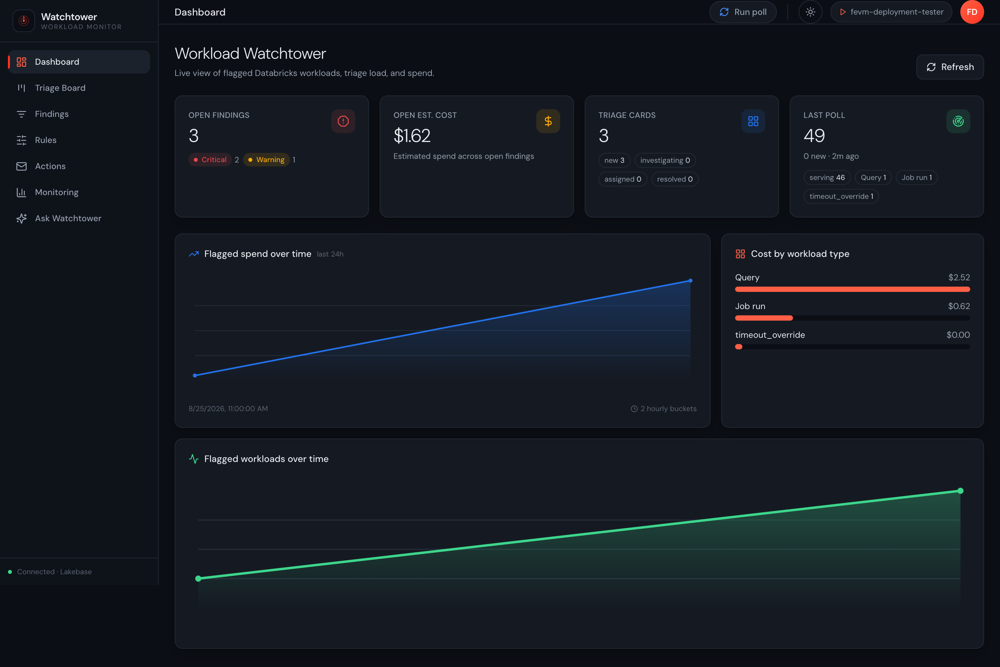
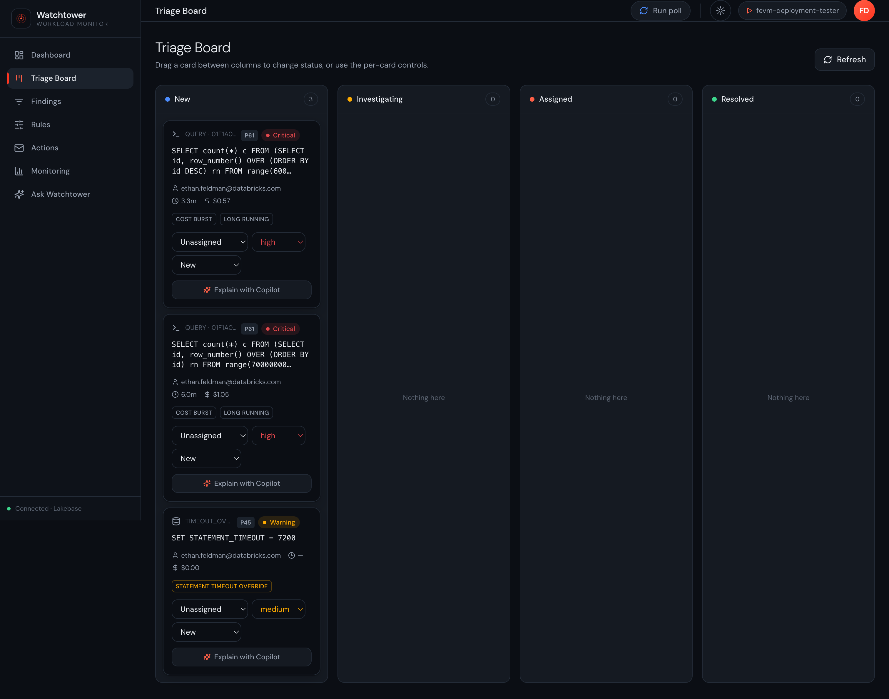
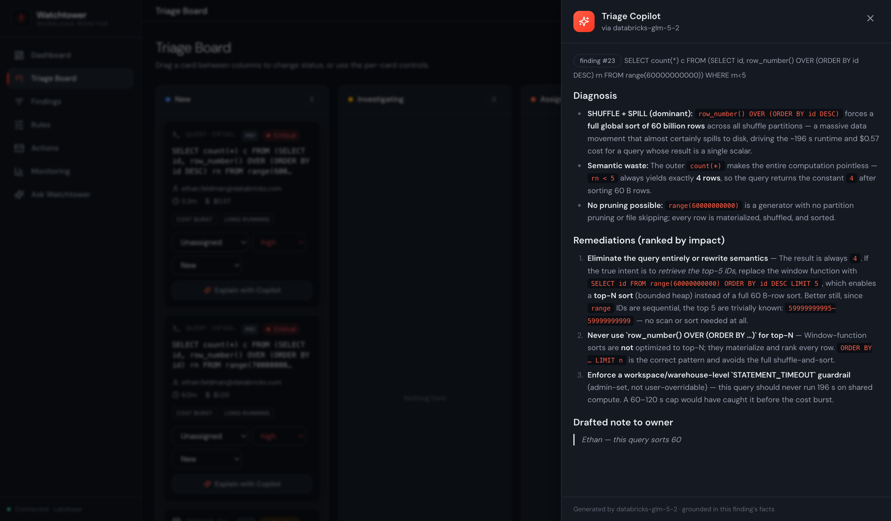
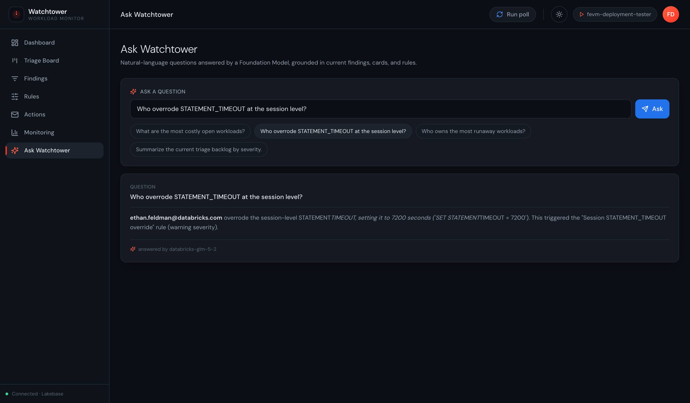
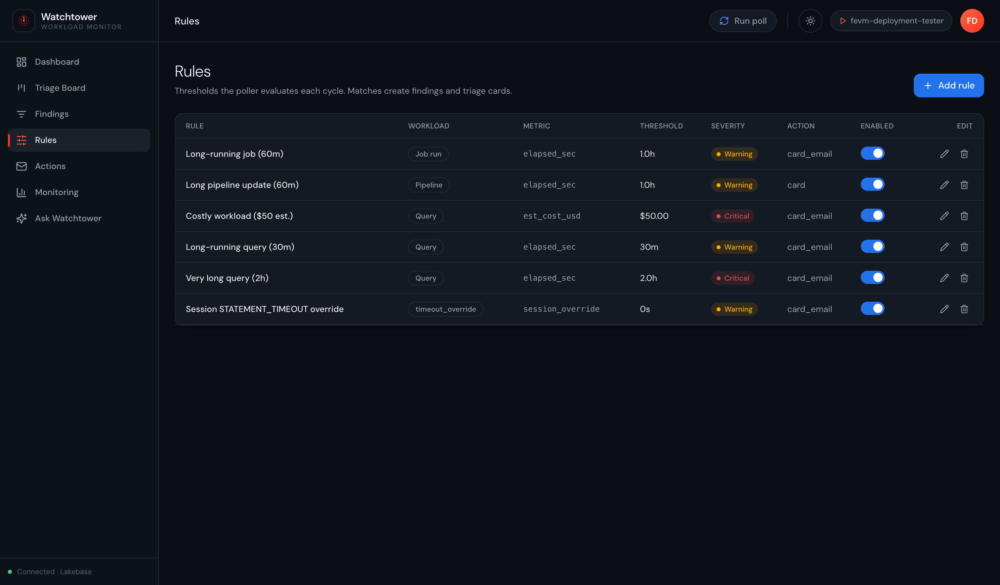
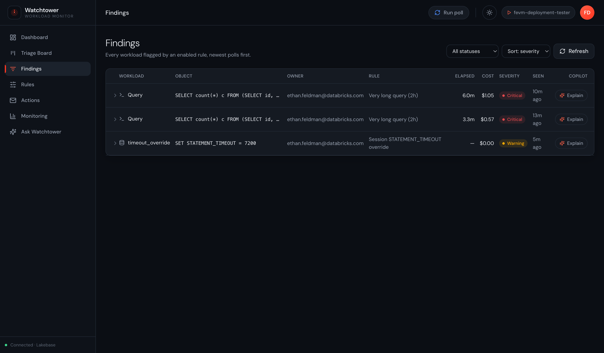
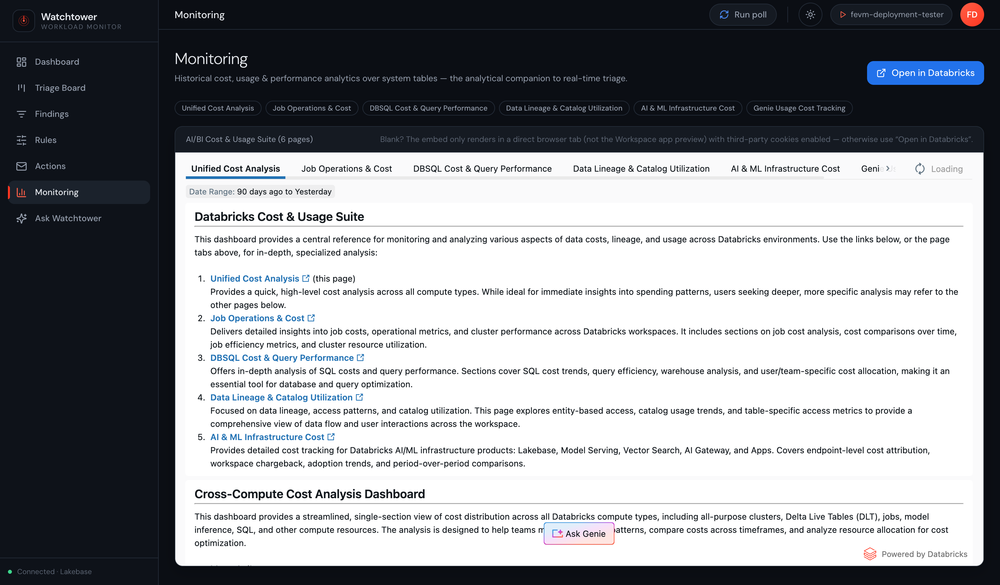

# Workload Watchtower

Catch runaway and cost-intensive Databricks workloads **while they're still running** — not a
day later in the billing data. Watchtower polls live REST APIs every ~5 minutes (Query History,
Jobs runs, pipeline updates, clusters, model serving), flags long-running or costly work against
your rules, and puts each finding on a triage board where it's scored, assigned, and can fire
email automations. A live cost *estimate* is reconciled against settled `system.billing.usage`
so you can see exactly why waiting on system tables isn't fast enough.

This is the self-hosted edition: it deploys into **your** workspace via a single setup script and
a step-by-step runbook. No demo data, no demo buttons.

## Why not just use system tables?

System tables are an analytics/chargeback layer, not a monitoring one: `system.query.history`
records a statement only *after* it finishes, and `system.billing.usage` settles cost with up to
a ~24h lag. Neither surfaces in-flight work early enough to act on. Watchtower fills that gap with
an admin-owned **poller** (a serverless Lakeflow job) that reads *live* state, backed by
**Lakebase** (mutable triage state) and **Unity Catalog Delta** (append-only history +
reconciliation), fronted by a **FastAPI + React** app.

## What you get

- **Live multi-workload detection** — SQL queries, job runs, pipelines, clusters, and serving
  endpoints, polled from the REST APIs (not lagging system tables).
- **Rule engine** — thresholds on elapsed time or estimated cost, plus a governance rule that flags
  **session-level `SET STATEMENT_TIMEOUT` overrides** (a user raising/removing your workspace or
  warehouse guardrail — session scope wins).
- **Triage board** — a Kanban (New → Investigating → Assigned → Resolved) with drag-and-drop,
  per-card assignee/priority/status, a 0–100 priority sort, and violation badges.
- **Email automations** — critical findings auto-send to a distribution list; warnings are drafted
  for one-click approval. Optional — configure SMTP or leave it off.
- **Live cost estimate + reconciliation** — proxy cost uses the live `system.billing.list_prices`
  rate; a UC view reconciles the estimate against settled usage.
- **Triage Copilot (AI)** — per-finding "Explain" that calls a Foundation Model (grounded in the
  finding + its real Query History operator metrics) to diagnose *why* it's slow/costly and give
  ranked, Databricks-specific remediations.
- **Ask Watchtower (AI)** — natural-language Q&A grounded in the current findings/cards/rules.
- **Monitoring page** — embeds a 6-page AI/BI "Cost & Usage Suite" dashboard over system tables —
  the historical companion to real-time triage. (Adapted from
  [mohanab89/databricks-dashboard-suite](https://github.com/mohanab89/databricks-dashboard-suite);
  see [`monitoring/NOTICE.md`](monitoring/NOTICE.md).)

## Screenshots

_From a live deployment. The dark, left-nav shell is styled to feel native to the Databricks
product._

**Dashboard** — open findings by severity, live estimated spend, triage load, last-poll workload
mix, and flagged spend/volume trends.



**Triage Board** — a Kanban of flagged workloads with per-card assignee/priority/status and
violation badges (`COST BURST`, `LONG RUNNING`, `STATEMENT TIMEOUT OVERRIDE`).



**Triage Copilot** — per-finding "Explain": a Foundation Model diagnoses *why* a workload is
slow/costly (grounded in its real Query History metrics) and gives ranked, Databricks-specific
remediations plus a drafted note to the owner.



**Ask Watchtower** — natural-language Q&A grounded in the current findings, cards, and rules.



**Rules** — thresholds on elapsed time / estimated cost, plus the session `SET STATEMENT_TIMEOUT`
governance rule — all editable in-app.



**Findings** — every open detection with owner, elapsed, estimated cost, and violation reason.



**Monitoring** — embeds the 6-page AI/BI "Cost & Usage Suite" dashboard over system tables (with an
in-dashboard **Ask Genie**) as the historical companion to real-time triage. Requires the workspace
to allow dashboard embedding — see [Enabling the Monitoring embed](#enabling-the-monitoring-embed).



## Architecture

```
  live REST/SDK reads                      ┌───────────────────────────────┐
  Query History / Jobs / Pipelines /       │  Lakebase (Autoscaling)        │
  Clusters / Serving                       │  findings · cards · rules      │
        │                                  │  subscribers · action_log      │
        ▼                                  │  it_members · poll_runs        │
  ┌─────────────────────────────┐  writes  └───────────────────────────────┘
  │  Poller (serverless job, 5m)│──────────▶┌───────────────────────────────┐
  └─────────────────────────────┘           │ UC Delta <catalog>.<schema>   │
        ▲                                    │ workload_snapshots            │
        │ triggers "Run poll"                │ alert_events                  │
  ┌─────────────────────────────┐            │ cost_reconciliation (view)    │
  │  FastAPI + React app         │──▶ SMTP   └───────────────────────────────┘
  │  Dashboard · Board · Rules   │   (opt.)
  │  Actions · Monitoring · Ask  │──▶ Foundation Model (Copilot / Ask)
  └─────────────────────────────┘
```

## Prerequisites

- A Databricks workspace with **Unity Catalog** and **serverless** enabled.
- You run setup as a **workspace admin** (the poller needs cross-user Query History / Jobs /
  Pipelines visibility).
- **Databricks CLI ≥ 0.285.0** (Lakebase Autoscaling commands) and an authenticated profile.
- A **serverless SQL warehouse** (for UC Delta reads + live list-price lookups).
- A Unity Catalog **catalog** you can create a schema in.
- A **chat serving endpoint** for the AI features (e.g. `databricks-claude-sonnet-5`).
- Local tooling: `python3`, `npm`, `jq`, `envsubst` (from `gettext`).

## Quickstart

```bash
# 1. Authenticate a CLI profile for your workspace
databricks auth login --host https://<workspace>.cloud.databricks.com --profile <profile>

# 2. Fill in your config
cp setup/config.env.example setup/config.env
$EDITOR setup/config.env

# 3. Run setup (idempotent; prints a plan and asks before making changes)
./setup/setup.sh
```

`setup/setup.sh` is idempotent and prints a plan for confirmation before making any change. In one
pass it:

1. Ensures the **Lakebase** (Autoscaling) project/branch/endpoint and discovers its host.
2. Creates the **UC history** schema + Delta tables + reconciliation view (on the warehouse).
3. Bootstraps the **Postgres schema** and seeds the governance **rules** (+ optional roster).
4. Creates the **Databricks App**, minting its **service principal**.
5. **Federates** that SP into Lakebase (`postgres create-role`) and **grants** it: Postgres schema
   privileges, UC `USE_CATALOG` / `USE_SCHEMA` / `SELECT` / `MODIFY`, warehouse `CAN_USE`, and
   `CAN_MANAGE_RUN` on the poller job (so the app's **Run poll** button works).
6. Deploys the **poller job** (serverless, on the schedule in `config.env`).
7. Optionally deploys the **Monitoring dashboard** (writing its URLs back to `config.env`) and
   writes **SMTP** secrets.
8. Renders `app/app.yaml`, builds the frontend, and **deploys the app** (from a staging copy, so
   the rendered `app.yaml` is uploaded).

Re-run it any time — completed steps are detected and reused.

**Then read [`docs/RUNBOOK.md`](docs/RUNBOOK.md)** for the steps a script can't safely do for you:
the account-admin grant to run the poller as the app SP, enabling AI/BI dashboard embedding, the
app-deploy UI fallback, and how to verify the end-to-end flow.

### Enabling the Monitoring embed

The **Monitoring** page embeds the AI/BI dashboard via an `/embed/dashboardsv3/<id>` URL, which the
workspace blocks by default — until embedding is enabled you'll see *"Embedding dashboards is not
available in this workspace."* in the page (the rest of the app is unaffected). A **workspace
admin** enables it once, in **Settings**:

1. **Embed dashboards** — Settings → Security → *AI/BI dashboard embedding*: allow all domains, or
   add the app's domain (`*.databricksapps.com`) to the approved list.
2. **Genie Agents** — enable if you want the dashboard's in-panel **Ask Genie** to work.

The embed renders in a **direct browser tab** with **third-party cookies enabled**; otherwise use
the page's **Open in Databricks** button. (`setup.sh` deploys and wires the dashboard either way —
this only controls whether it renders *inside* the app.)

## Service principals & the poller identity

Two identities matter; understanding them makes the permission model (and the runbook) clear.

- **The app service principal** — auto-minted when the app is created. `setup.sh` federates it into
  Lakebase and grants it everything the *running app* needs: Lakebase schema access, UC read/write
  on the history schema, warehouse `CAN_USE`, and run permission on the poller job. The app mints
  short-lived Lakebase credentials with this SP's own OAuth token (no stored password), and
  `PGUSER` is set to the SP's client id (its federated Postgres role).

- **The poller's `run_as` identity** — who the scheduled poller job runs as. It reads *all* users'
  Query History / Jobs / Pipelines, so this identity **must be a workspace admin**.
  - **Default: the deploying admin (you).** With no `run_as` in `databricks.yml`, the bundle runs
    the job as whoever deploys it. Simplest, and needs no extra grant — just be a workspace admin.
  - **Recommended for production: the app SP**, so the job isn't tied to a person. This needs one
    **account-admin** action — granting your user the `servicePrincipal.user` role *on the app SP*
    so the bundle can bind `run_as` to it — then a small `run_as` edit in `databricks.yml`. Full
    steps are in [`docs/RUNBOOK.md`](docs/RUNBOOK.md) → *Run the poller as the app service
    principal*. (The SP is already a workspace admin and Lakebase/UC/warehouse-granted from setup;
    the app SP triggering the job via the Run-poll button works either way.)

There is **no dedicated poller SP** — the app SP is reused for both roles to keep the identity and
grant surface small.

## Configuration

Everything is driven by `setup/config.env` (copied from `config.env.example`) — workspace/profile,
warehouse, `<catalog>.<schema>`, Lakebase project, app name, model, and optional SMTP + roster.
Nothing environment-specific is hardcoded in the app, bundle, or poller. `config.env` and the
rendered `app/app.yaml` are gitignored.

To seed an assignable roster, point `SEED_MEMBERS_JSON` at a file like
[`setup/it_members.example.json`](setup/it_members.example.json). Left empty, cards start
unassigned and you assign them in the app.

## Operations

- **Schedule** — the poller runs every 5 min (`poller_schedule` in `config.env`). The app's
  **Run poll** button triggers it on demand.
- **Rules** — thresholds, severity, action, enabled — all editable in the **Rules** tab.
- **Email** — recipients are managed in **Actions → Distribution list**; SMTP config lives in the
  secret scope. No SMTP = nothing is emailed (findings still appear on the board).
- **AI model** — `WT_MODEL` selects the Foundation Model; swap endpoints in `config.env` and re-run
  the app-deploy step. Calls go through the workspace serving endpoints — route via AI Gateway for
  governance/telemetry.
- **Re-run setup** any time — it's idempotent and only creates what's missing.

## Local development

```bash
set -a && . setup/config.env && set +a
export DATABRICKS_CONFIG_PROFILE=$DATABRICKS_PROFILE PGUSER=$(databricks current-user me -o json | jq -r .userName)
cd app && python -m uvicorn app:app --port 8000        # backend (uses your CLI profile)
cd app/frontend && npm install && npm run dev           # frontend on :5173, proxies /api → :8000
```

## License

Apache 2.0 — see [`LICENSE`](LICENSE). The Monitoring dashboard JSON is adapted from a third-party
source; see [`monitoring/NOTICE.md`](monitoring/NOTICE.md).
